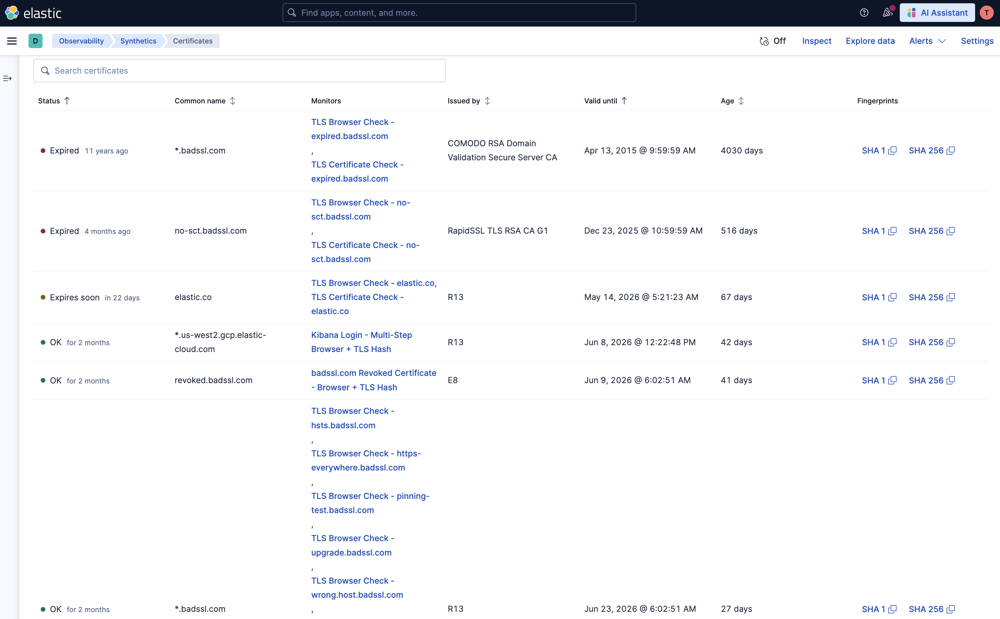

# aiops-synthetics-lab

**Companion repository** for the Elastic Observability Labs article *Automated Certificate Monitoring and Self-Healing* (April 2026) — a closed-loop, certificate-focused pipeline that uses **Elastic Synthetics** (client-side chain), **ES|QL** alerting, **Osquery** / host inventory (queried from Workflows in the article), and **Elastic Workflows** for remediation and verification. The article walks through the **Sense → Think → Act → Verify** loop; this repo is the **monitors-as-code** and sample **Workflow / alert** source the article references by that name on GitHub.

> **On GitHub, use the repository `aiops-synthetics-lab`** (for example `https://github.com/adrianchen-es/aiops-synthetics-lab`) so it matches the article’s clone instructions. The article also points to *Automated Reliability: The Architecture of Self-Healing Enterprises* for the broader self-healing “why.”

| Phase | Role | In this repository |
|------|------|-------------------|
| **Sense** | Browser checks → `synthetics-*`, optional host inventory | `journeys/` (notably `tls-browser/`), `helpers/tls.ts`, `logCertInfo()`; **`docs/ingest-pipeline-synthetics-browser.json`** maps **`TLS_CERT`** stdout into **`tls.server.*`** for the Kibana TLS UI ([details](#kibana-tls-ui-and-synthetics-browsercustom-ingest-pipeline)) |
| **Think** | ES|QL on Synthetics, deduplicated by CN + `tags` | `docs/elastic-samples/alerts/*.md` (paste queries into rules) |
| **Act** | Smart escalation, tickets, optional automation | `docs/elastic-samples/workflows/01-smart-certificate-rotation-escalation-remediation.yaml` |
| **Verify** | Re-check after rotation, canary impact | `local-lab/` (short-lived certs), `docs/elastic-samples/workflows/02-canary-certificate-impact-check.yaml` |

**Stack note (from the article):** target **Elastic Stack 9.1+** for ES|QL features used in the lab; **Elastic Workflows** is **Technical Preview in 9.3+**. **Elastic Agent** with the **Osquery Manager** integration is assumed for host-side steps described in the article (not shipped inside this Node repo).

This project extracts and validates TLS server certificate fingerprints (SHA-256 primary, SHA-1 optional) and combines browser page tests with TLS certificate inspection. Journeys live under **`journeys/`** in subfolders (`tls/`, `tls-browser/`, `demos/`, `kibana/`) so you can run or push **all monitors** or **one group** (see [Running locally](#running-locally) and [Pushing monitors to Elastic](#pushing-monitors-to-elastic)). Localized **`tls-target-hosts.csv`** files drive CSV-expanded monitors: **`journeys/tls/`** for `tls.journey.ts` and **`journeys/tls-browser/`** for `tls-browser.journey.ts` (browser step plus optional DOM check; can include additional hosts such as `cloud.elastic.co`). The **`criticality`** column becomes tags on each monitor and flows into alert payloads, as in the article.

[](https://github.com/adrianchen-es/aiops-synthetics-lab/actions/workflows/ci.yml)

---

## Journeys

| Journey file | Type | Target | Description |
|---|---|---|---|
| `journeys/tls/tls-certificate.journey.ts` | TLS-only | Configurable (default: `example.com`) | Generic host TLS hash extraction — no browser, minimal overhead |
| `journeys/tls/tls.journey.ts` | Playwright + TLS | Hosts from `journeys/tls/tls-target-hosts.csv` | One step per host: route-stubbed `goto` for URL telemetry, then SHA-256, expiry, and OS trust assertions |
| `journeys/tls-browser/tls-browser.journey.ts` | Playwright + TLS | `journeys/tls-browser/tls-target-hosts.csv` | Step 1 matches the TLS step in `tls.journey.ts`; step 2 loads the real page (cert errors tolerated via context routing) with an optional `assertionText` / `assertionSelector` check |
| `journeys/demos/badssl-revoked.journey.ts` | Browser + TLS | `revoked.badssl.com` | Single-page browser test + SHA-256 fingerprint for a revoked certificate |
| `journeys/kibana/kibana-login.journey.ts` | Browser + TLS | Elastic Cloud Kibana | Multi-step login flow + SHA-256 fingerprint |
| `journeys/demos/self-signed-ca.journey.ts` | TLS-only | `self-signed.badssl.com` | Demonstrates CA trust failure and fingerprint extraction regardless |

See **`journeys/README.md`** for a short folder map and command cheat sheet.

All TLS extraction uses the Node.js built-in `tls` module — the SHA-256 fingerprint is read directly from `cert.fingerprint256`, a value pre-computed by OpenSSL during the TLS handshake at zero extra cost. No browser is launched for the certificate inspection steps.

---

## How it works

### TLS-only journey (`journeys/tls/tls-certificate.journey.ts`)

* Opens a raw TLS socket to the target host
* Reads the SHA-256 fingerprint from `cert.fingerprint256` (pre-computed by OpenSSL — no extra hashing step)
* SHA-1 is also available as an optional field (`cert.fingerprint`) but is not asserted
* Asserts the certificate has not expired
* No browser launched → typically completes in < 200 ms

### badssl.com Revoked Certificate journey (`journeys/demos/badssl-revoked.journey.ts`)

* **Step 1 – Browser:** navigates to `https://revoked.badssl.com/` and checks the page title
* **Step 2 – TLS:** extracts the SHA-256 fingerprint and checks whether the OS trust store detects the revocation

> Chromium uses soft-fail OCSP checking in headless mode, so the browser page loads despite the revocation. The `ignoreHTTPSErrors: true` Playwright option is set in `synthetics.config.ts` to confirm this is intentional for these demo journeys.

### Kibana Login journey (`journeys/kibana/kibana-login.journey.ts`)

* **Step 1 – Browser:** navigates to the Kibana URL, verifies the login page is shown
* **Step 2 – Browser:** clicks the "Log in with Elasticsearch" button
* **Step 3 – Browser:** verifies the native auth username/password form appears
* **Step 4 – TLS:** extracts the SHA-256 fingerprint and asserts the cert is not expired

The target Kibana URL defaults to `https://ac-siem-hosted-a183da.kb.us-west2.gcp.elastic-cloud.com/` but can be overridden via `KIBANA_TARGET_URL` or the monitor `params.targetUrl` field.

### Self-Signed / Internal CA journey (`journeys/demos/self-signed-ca.journey.ts`)

* **Step 1 – TLS:** confirms the connection is **rejected** when no custom CA is loaded (correct security behaviour)
* **Step 2 – TLS:** extracts the SHA-256 fingerprint with `rejectUnauthorized: false` (always succeeds regardless of CA trust)
* **Step 3 – TLS:** asserts the certificate is not expired (independent of CA trust)

To trust an internal CA, pass its PEM to `fetchCertInfo(host, port, { ca })` — see `helpers/tls.ts` for details.

### CSV-driven TLS journeys (`journeys/tls/tls.journey.ts` and `journeys/tls-browser/tls-browser.journey.ts`)

**Source of truth:** edit the **`tls-target-hosts.csv`** next to each group (`journeys/tls/`, `journeys/tls-browser/`, etc.). The script **`npm run generate:tls-targets`** (also run automatically before `npm test`, `npm run test:dry`, and `npm run push`) discovers every localized **`tls-target-hosts.csv`** under **`journeys/`**, parses via **`helpers/loadTlsTargetHosts.ts`**, and writes **`helpers/tlsTargetHosts.<slug>.generated.ts`** per CSV (see **`helpers/tlsTargetCsvDiscovery.ts`**). Each journey imports `TLS_TARGET_HOSTS` from its matching generated module, so Elastic workers never read CSV from disk.

Commit the generated **`tlsTargetHosts.*.generated.ts`** files alongside CSV changes so clones stay in sync; `push` still regenerates them before upload.

To add a new TLS group, create **`journeys/<name>/tls-target-hosts.csv`** and import from **`helpers/tlsTargetHosts.<slug>.generated.ts`** where `<slug>` is the path under `journeys/` with `/` replaced by `.` (for example `journeys/my-scope/` → `tlsTargetHosts.my-scope.generated.ts`).

| Column | Required | Description |
|--------|----------|-------------|
| `host` | Yes | Hostname to test (HTTPS on port 443). A row may be host-only with no comma, or `host,` with an empty second field. |
| `criticality` | No | One of `critical`, `high`, `medium`, `low`. When set, the journey gets a tag `criticality:<value>` for filtering in Kibana. When empty or omitted, no criticality tag is added. |
| `assertionText` | No | Used only by **`journeys/tls-browser/tls-browser.journey.ts`** step 2. |
| `assertionSelector` | No | CSS selector for the element that should contain `assertionText`. |

Optional assertions run **only when both** `assertionText` and `assertionSelector` are non-empty; otherwise step 2 only checks that navigation returns a response.

The recommended header row is:

`host,criticality,assertionText,assertionSelector`

Lines starting with `#` and blank lines are ignored.

---

## Prerequisites

| Tool | Minimum version | Notes |
|------|----------------|-------|
| Node.js | 18 LTS | 20 LTS or 22 LTS also supported |
| npm | 9 | Bundled with Node.js 18+ |

### Installing Node.js

Choose the method that suits your operating system:

**macOS — using [nvm](https://github.com/nvm-sh/nvm) (recommended)**
```bash
curl -o- https://raw.githubusercontent.com/nvm-sh/nvm/v0.40.3/install.sh | bash
# Restart your terminal, then:
nvm install 20
nvm use 20
```

**macOS — using [Homebrew](https://brew.sh)**
```bash
brew install node@20
```

**Linux (Debian/Ubuntu)**
```bash
curl -fsSL https://deb.nodesource.com/setup_20.x | sudo -E bash -
sudo apt-get install -y nodejs
```

**Linux (RHEL/Amazon Linux)**
```bash
curl -fsSL https://rpm.nodesource.com/setup_20.x | sudo bash -
sudo yum install -y nodejs
```

**Windows — using [nvm-windows](https://github.com/coreybutler/nvm-windows) (recommended)**

Download and run the installer from [nvm-windows releases](https://github.com/coreybutler/nvm-windows/releases/latest), then in **PowerShell (Run as Administrator)**:
```powershell
nvm install 20
nvm use 20
```

**Windows — using [winget](https://learn.microsoft.com/en-us/windows/package-manager/winget/) (PowerShell)**
```powershell
winget install OpenJS.NodeJS.LTS
```

**All platforms — [official installer](https://nodejs.org/en/download)**
Download the LTS installer from [nodejs.org](https://nodejs.org/en/download) for a guided setup on any OS.

Verify your installation:
```bash
node --version   # should print v18.x.x, v20.x.x, or v22.x.x
npm --version    # should print 9.x.x or higher
```

---

## Installation

```bash
# Clone the repository (name matches the Elastic Observability Labs article)
git clone https://github.com/adrianchen-es/aiops-synthetics-lab.git
cd aiops-synthetics-lab

# Install all dependencies (uses package-lock.json for reproducible installs)
npm ci
```

> **Note:** `npm ci` is preferred over `npm install` — it installs exact versions from `package-lock.json` and fails fast if the lockfile is out of sync, preventing unexpected version drift.

---

## Running locally

### macOS / Linux

```bash
# Validate journey structure without network access
npm run test:dry

# Run unit tests for helper functions (no network needed)
npm run test:unit

# Run all CI-safe checks (dry-run + unit tests)
npm run test:ci

# Run all journeys (requires network access)
npm test

# Run only one folder (network required)
npm run test:tls
npm run test:demos
npm run test:kibana

# After editing any journeys/**/tls-target-hosts.csv — refreshes helpers/tlsTargetHosts.*.generated.ts (also runs automatically before npm test, test:dry, and push)
npm run generate:tls-targets

# Override the target host for the TLS-only journey
TLS_TARGET_HOST=myserver.example.com TLS_TARGET_PORT=8443 npm test

# Override the Kibana URL for the login journey
KIBANA_TARGET_URL=https://my-kibana.example.com npm test
```

### Windows (PowerShell)

```powershell
# Validate journey structure without network access
npm run test:dry

# Run unit tests for helper functions (no network needed)
npm run test:unit

# Run all CI-safe checks
npm run test:ci

# Run all journeys (requires network access)
npm test

# Run only one folder
npm run test:tls
npm run test:demos
npm run test:kibana

# Override the target host for the TLS-only journey
$env:TLS_TARGET_HOST="myserver.example.com"; $env:TLS_TARGET_PORT="8443"; npm test

# Override the Kibana URL for the login journey
$env:KIBANA_TARGET_URL="https://my-kibana.example.com"; npm test
```

### Windows (Command Prompt)

```cmd
set TLS_TARGET_HOST=myserver.example.com && set TLS_TARGET_PORT=8443 && npm test
set KIBANA_TARGET_URL=https://my-kibana.example.com && npm test
```

---

## Continuous Integration

The repository includes a GitHub Actions workflow at `.github/workflows/ci.yml` that runs on every push and pull request:

1. **TypeScript type-check** (`npx tsc --noEmit`)
2. **Journey structure validation** (`npm run test:dry`) — no network required
3. **Unit tests** (`npm run test:unit`) — no network required

---

## Pushing monitors to Elastic

### Step 1 — Set credentials

**macOS / Linux**
```bash
export KIBANA_URL="https://your-deployment.kb.us-east-1.aws.elastic-cloud.com"
export SYNTHETICS_API_KEY="<your-kibana-api-key>"
```

**Windows (PowerShell)**
```powershell
$env:KIBANA_URL = "https://your-deployment.kb.us-east-1.aws.elastic-cloud.com"
$env:SYNTHETICS_API_KEY = "<your-kibana-api-key>"
```

**Windows (Command Prompt)**
```cmd
set KIBANA_URL=https://your-deployment.kb.us-east-1.aws.elastic-cloud.com
set SYNTHETICS_API_KEY=<your-kibana-api-key>
```

> **Creating a Kibana API key:**
> Kibana → Synthetics → Settings → Project API Keys → Generate Project API Key

### Step 2 — Push monitors

```bash
# Push every journey under journeys/ (all folders)
npm run push

# Push only one folder (same project id as full push; see note below)
npm run push:tls
npm run push:demos
npm run push:kibana

# Push to a named space (e.g. staging) — entire project under journeys/
npm run push:staging
```

`push` and `push:*` run **`npm run generate:tls-targets`** first so **`helpers/tlsTargetHosts.*.generated.ts`** matches each **`tls-target-hosts.csv`** under **`journeys/`** before upload.

Folder-scoped pushes use **`elastic-synthetics push --pattern …`** (see `scripts/push-journeys.ts`): only `*.journey.ts` files whose path matches `journeys/<folder>/...` are bundled. Monitors are still grouped under the same **`project.id`** from **`synthetics.config.ts`**. Pushing a subset updates or creates those monitors only; it does not remove monitors that were previously pushed from other folders (remove those in Kibana or run a deliberate project cleanup if you need that).

### CI/CD — inline credentials

```bash
KIBANA_URL="https://..." SYNTHETICS_API_KEY="..." npm run push
```

---

## Local lab: 1-day self-signed certs (Nginx / Apache)

The **[`local-lab/`](local-lab/)** directory contains a small Docker-based setup that issues a **one-day** self‑signed key pair, serves it over **HTTPS** with **Nginx** or **Apache** (separate Compose profiles, host ports **8443** and **8444**), and documents how to run **`journeys/tls/tls-certificate.journey.ts`** with `TLS_TARGET_HOST` and `TLS_TARGET_PORT` to simulate **expiry failure**, **renew** (re-issue + container restart and new fingerprint), and **Kibana** notification patterns. See **[`local-lab/README.md`](local-lab/README.md)** for step-by-step use.

The CSV-based TLS monitors (`tls.journey.ts` / `tls-browser.journey.ts`) target port **443** and assert public trust, so the generic **`tls-certificate.journey.ts`** is the one intended for this self-signed lab.

---

## Project structure

```
.
├── .github/
│   └── workflows/
│       └── ci.yml                          # GitHub Actions CI workflow
├── local-lab/                              # Optional: 1-day self-signed certs, Nginx/Apache (see local-lab/README.md)
│   ├── docker-compose.yml
│   ├── scripts/                          # gen-tls-certs.sh, renew-tls-certs.sh
│   ├── nginx/ · apache/
│   └── README.md
├── docs/
│   ├── ingest-pipeline-synthetics-browser.json  # PUT as _ingest/pipeline/synthetics-browser@custom
│   ├── elastic-samples/         # Workflows (YAML) + alerts (Markdown, ES|QL in fenced blocks; see README)
│   │   ├── workflows/ · alerts/
│   │   └── README.md
│   └── images/
│       └── tls_ui_with_browser_synthetics.png   # Kibana TLS UI (after pipeline + new data)
├── helpers/
│   ├── loadTlsTargetHosts.ts               # CSV parser (build-time only)
│   ├── tlsTargetCsvDiscovery.ts            # Finds localized tls-target-hosts.csv under journeys/
│   ├── tlsTargetHosts.tls.generated.ts     # Generated from journeys/tls/tls-target-hosts.csv — do not edit
│   ├── tlsTargetHosts.tls-browser.generated.ts
│   └── tls.ts                              # Shared TLS utility functions
├── scripts/
│   ├── generate-tls-targets.ts             # One generated module per localized tls-target-hosts.csv
│   └── push-journeys.ts                    # push helper: all | tls | demos | kibana
├── journeys/
│   ├── README.md                           # Folder map and quick commands
│   ├── tls/
│   │   ├── tls-target-hosts.csv            # Host list for tls.journey
│   │   ├── tls-certificate.journey.ts      # TLS-only, configurable host
│   │   └── tls.journey.ts                  # Per-row TLS monitor from CSV
│   ├── tls-browser/
│   │   ├── tls-target-hosts.csv            # Host list for tls-browser (can include extra hosts)
│   │   └── tls-browser.journey.ts          # Per-row TLS + browser monitor from CSV
│   ├── demos/
│   │   ├── badssl-revoked.journey.ts       # Browser + TLS, revoked cert demo
│   │   └── self-signed-ca.journey.ts       # Self-signed / internal CA demo
│   └── kibana/
│       └── kibana-login.journey.ts         # Multi-step browser + TLS (Kibana)
├── tests/
│   └── tls-helpers.test.ts                 # Unit tests for helper functions
├── synthetics.config.ts                    # Elastic Synthetics project config
├── tsconfig.json                           # TypeScript compiler config
├── package.json                            # Dependencies & npm scripts
├── package-lock.json                       # Lockfile for reproducible installs
└── .gitignore                              # OS, editor, Node & secret exclusions
```

---

## Dependencies

| Package | Type | Purpose |
|---------|------|---------|
| `@elastic/synthetics` | production | Journey runner, `journey`/`step`/`expect` APIs, Playwright bundled |
| `@types/node` | dev | TypeScript types for Node.js built-ins (`tls`, `crypto`, `Buffer`) |
| `tsx` | dev | Runs TypeScript test files directly with `node --import tsx --test` |
| `typescript` | dev | Type-checking (`npx tsc --noEmit`) |

`@elastic/synthetics` bundles its own Playwright installation — no separate `playwright install` step is needed.

---

## Configuration reference

Edit **`synthetics.config.ts`** to change project-wide settings:

| Setting | Default | Description |
|---------|---------|-------------|
| `project.id` | `ac-synthetics-tls-demo` | Unique monitor project ID in Kibana |
| `project.url` | env `KIBANA_URL` | Kibana URL |
| `project.space` | `default` | Kibana space |
| `monitor.schedule` | `15` (minutes) | How often each monitor runs |
| `monitor.locations` | `us_east` | Elastic-managed location(s) |
| `monitor.privateLocations` | | Private Synthetic location(s) |
| `playwrightOptions.ignoreHTTPSErrors` | `true` | Required for revoked/self-signed cert journeys |

Per-journey environment variables:

| Variable | Journey | Default | Description |
|---|---|---|---|
| `TLS_TARGET_HOST` | `tls-certificate` | `example.com` | Hostname to inspect |
| `TLS_TARGET_PORT` | `tls-certificate` | `443` | Port to connect on |
| `KIBANA_TARGET_URL` | `kibana-login` | *(Elastic Cloud demo)* | Kibana URL to test |

**`journeys/tls/tls.journey.ts`** and **`journeys/tls-browser/tls-browser.journey.ts`** do not use the variables above; at **runtime** (including on Elastic) they import **`TLS_TARGET_HOSTS`** from **`helpers/tlsTargetHosts.tls.generated.ts`** and **`helpers/tlsTargetHosts.tls-browser.generated.ts`**, produced by **`npm run generate:tls-targets`** (see **`package.json`**).

---

## Security notes

* `rejectUnauthorized: false` is used only in certificate inspection contexts — the socket is destroyed immediately after `getPeerCertificate()` returns. No application data is exchanged.
* `ignoreHTTPSErrors: true` in `synthetics.config.ts` is intentional for this demo project which targets hosts with deliberately problematic certificates. Do not use this in production monitors that make authenticated requests.
* SHA-256 (`cert.fingerprint256`) is the primary fingerprint. SHA-1 (`cert.fingerprint`) is available as an optional field but should not be used as a sole trust anchor.
* API keys are excluded from version control via `.gitignore`.
* `package-lock.json` **is** committed to enable reproducible `npm ci` installs in CI.

---

## Kibana TLS UI and synthetics-browser@custom ingest pipeline

Hybrid and browser journeys call **`logCertInfo()`** in **`helpers/tls.ts`**, which prints one **stdout** line per TLS check in this shape: `TLS_CERT,<json>,TLS_HASH,<json>`. The JSON blocks mirror the **`tls.server.x509`** and **`tls.server.hash`** field layout. Elastic Synthetics stores that line on the document under **`synthetics.payload.message`** (type **`stdout`**).

Without further processing, that text does **not** populate the **`tls.server.*`** fields that drive the **TLS** summary in Observability, so the TLS card can appear empty even when the journey succeeded.

This repo ships an ingest pipeline definition named **`synthetics-browser@custom`**, the hook Elasticsearch uses for **custom processing on browser synthetics** data. The pipeline:

- Matches **`stdout`** messages that start with **`TLS_CERT`** and contain **`TLS_HASH`**
- **Dissect** + **json** processors copy the embedded JSON into **`tls.server.x509`** and **`tls.server.hash`**
- **gsub** strips colons from fingerprint hex so values match the UI’s expected form
- Sets **`summary.final_attempt`** to **`true`** (boolean) when both certificate and hash are present

**Pipeline definition (version in repo):** [`docs/ingest-pipeline-synthetics-browser.json`](docs/ingest-pipeline-synthetics-browser.json)

### Install on your cluster

Use **Kibana → Dev Tools** and run **`PUT _ingest/pipeline/synthetics-browser@custom`** with the JSON from that file, or from the repo root:

```bash
curl -X PUT \
  -H "Content-Type: application/json" \
  -u "elastic:$ELASTIC_PASSWORD" \
  "https://YOUR_CLUSTER_HOST:9243/_ingest/pipeline/synthetics-browser%40custom" \
  --data-binary @docs/ingest-pipeline-synthetics-browser.json
```

Encode **`@`** as **`%40`** in the URL. Adjust host, port, and auth to match your deployment (Elastic Cloud often uses port **9243** or **443** for Elasticsearch). 
**Ensure you target your deployment's Elasticsearch endpoint.**

After the pipeline is installed, **new** browser synthetic documents that include the **`TLS_CERT`** stdout line should show certificate details in the TLS UI, for example:



### Sample Elastic Workflows and alert queries

**[`docs/elastic-samples/`](docs/elastic-samples/)** matches the **Think** and **Act** / **Verify** material in *Automated Certificate Monitoring and Self-Healing*: two **Workflow** YAMLs (escalation/remediation and canary `curl_certificate` impact) and two **`alerts/*.md`** files with **ES|QL** in fenced blocks (a **30-day** look-ahead variant; the article’s query uses **90** days—see that README). Copy queries into a Kibana **ES|QL** rule and set schedule, **display name** (for downstream meta-alerts), and actions in the UI. Details: **[`docs/elastic-samples/README.md`](docs/elastic-samples/README.md)**.

---

